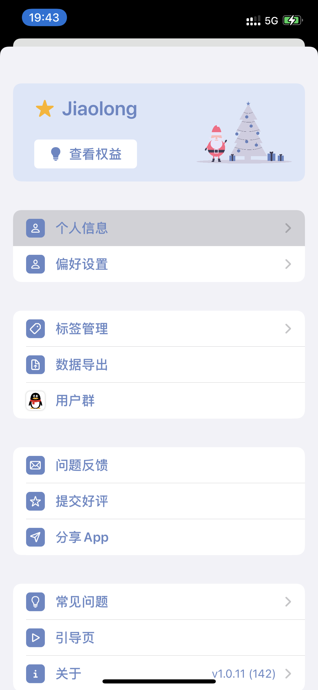

## style：

- DefaultListStyle
- GroupedListStyle
- InsetListStyle
- InsetGroupedListStyle
- SidebarListStyle
- PlainListStyle

```swift
List{
 
}.listStyle(InsetGroupedListStyle())
```


## 填充行背景：


##  取消返回根目录时高亮选中项

```swift
.onReceive(NotificationCenter.default.publisher(for: UITableView.selectionDidChangeNotification)) {
	guard let tableView = $0.object as? UITableView,
	let selectedRow = tableView.indexPathForSelectedRow else { return }
	tableView.deselectRow(at: selectedRow, animated: true)
}
```


